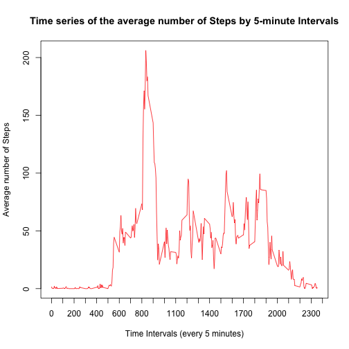

## Loading and preprocessing data

The following R code unzips and loads the required data; it calls also the libraries required to perform the assignment:


```r
unzip("activity.zip")
data <- read.csv("activity.csv", header = TRUE)
library(plyr)
library(ggplot2)
library(Hmisc)
library(knitr)
```

## What is mean total number of steps taken per day?

The following R code processes data to get an histogram of the total number of steps taken each day (ignoring the missing values), and then it plots the histogram that you can see below.


```r
nona <- data[complete.cases(data),]
daystepsum <- ddply(nona, .(date), numcolwise(sum), drop=FALSE)
y <- daystepsum[,2]
hist(y, col="red", 
     main="Histogram of total number of Steps taken each Day",
     xlab="Total number of Steps each Day")
```

 

The following R code computes the mean and median total number of steps taken per day.


```r
daymean <- mean(daystepsum[,2])
daymedian <- median(daystepsum[,2])
report1 <- paste("Total steps per day: Mean=", round(daymean,2),
                 ", Median=",daymedian)
report1
```

```
## [1] "Total steps per day: Mean= 10766.19 , Median= 10765"
```

## What is the average daily activity pattern?

The following R code processes data to compute the average number of steps taken within each 5 minutes time interval of the day, and then it plots a time series of these data.


```r
timestepmean <- ddply(nona, .(interval), numcolwise(mean), drop=FALSE)
plot(timestepmean$interval, timestepmean$steps, col="red", xaxt="n",
     xlab="Time Intervals (every 5 minutes)", ylab="Average number of Steps")
lines(timestepmean$interval, timestepmean$steps, type="l", col="red")
axis(side=1, at=seq(0,2400,by=100))
title(main="Time series of the average number of Steps by 5-minute Intervals")
```

 

The following R code detects and shows which 5 minute interval, on average across all the days in the dataset, contains the maximum number of steps.


```r
rowmax <- which.max(timestepmean[,2])
maxintv <- timestepmean[rowmax,1]
report2 <- paste("5-minute interval containing (in average) the max.number of steps=",
                 maxintv)
report2
```

```
## [1] "5-minute interval containing (in average) the max.number of steps= 835"
```

## Imputing missing values

The following R code detects and shows the total number of rows with missing (NA's) values.


```r
narows <- unique (unlist (lapply (data, function (x) which (is.na (x)))))
missing <- length(narows)
report3 <- paste("Total number of rows containing missing values in the dataset=",
                 missing)
report3
```

```
## [1] "Total number of rows containing missing values in the dataset= 2304"
```

I decided to replace the steps missing values with the total number of steps (in average, and rounded to the nearest integer), computed for the same 5-minute interval across all other days.
The following R code creates a new dataset that is equal to the original, but with the missing data replaced according to the strategy above described.


```r
impdata <- ddply(data, "interval", mutate, complsteps = impute(steps, mean))
impdata$complsteps <- round(impdata$complsteps,0)
drops <- "steps"
compldata <- impdata[,!(names(impdata) %in% drops)]
compldaystepsum <- ddply(compldata, .(date), numcolwise(sum), drop=FALSE)
```

The following R code plots the histogram of the total number of steps taken each day according to the new dataset, filled in with the imputed values.


```r
y <- compldaystepsum[,3]
hist(y, col="light blue", 
     main="Histogram of total number of Steps by Day  (missing values filled-in)",
     xlab="Total number of Steps each Day")
```

 

The following R code computes the mean and median total number of steps taken each day for the new dataset containing the imputed values.


```r
compldaymean <- mean(compldaystepsum[,3])
compldaymedian <- median(compldaystepsum[,3])
report4 <- paste("Filled-in Dataset, total steps per day: Mean=",round(compldaymean,2),
                 ", Median=",compldaymedian)
report4
```

```
## [1] "Filled-in Dataset, total steps per day: Mean= 10765.64 , Median= 10762"
```

The above values of mean and median are slightly lower but pretty close to those computed for the original dataset. The overall impact on frequency distribution of imputing missing data is not much heavy. It clearly increases the frequencies of values around the mean, but the shape of the frequency distribution remains quite similar to that of the original dataset. 

## Are there differences in activity patterns between weekdays and weekends?

The following R code adds to the new dataset (that with the filled-in missing values) a new column containing a factor variable with two levels, "weekday" and "weekend", indicating whether a given date is a weekday or weekend day.


```r
datesfactor <- compldata[,1]
dates <- as.Date(datesfactor, format = "%Y-%m-%d")
weekd <- weekdays(dates)
weekdayend <- weekd
weekdayend <- sub("Monday", "weekday", weekdayend)
weekdayend <- sub("Tuesday", "weekday", weekdayend)
weekdayend <- sub("Wednesday", "weekday", weekdayend)
weekdayend <- sub("Thursday", "weekday", weekdayend)
weekdayend <- sub("Friday", "weekday", weekdayend)
weekdayend <- sub("Saturday", "weekend", weekdayend)
weekdayend <- sub("Sunday", "weekend", weekdayend)
wkday <- as.factor(weekdayend)
compldatawd <- cbind(compldata, wkday)
```

The following R code processes the new filled-in dataset to compute the average number of steps taken within each 5 minutes time interval of the day, and then it plots a panel plot containing the time series of these data, comparing the step patterns (in average) across weekdays versus weekend days.


```r
compltimestepmean <- ddply(compldatawd, .(wkday, interval), numcolwise(mean), drop=FALSE)
g <-ggplot(compltimestepmean, aes(x=interval, y=complsteps)) + geom_point(shape=1) 
g <- g + geom_line()
g <- g + facet_grid(wkday ~ .)
g <- g + scale_x_continuous(breaks=seq(0,2400,by=200))
g <- g + labs(y = "Average number of Steps (missing Values replaced by imputed Values)")
g <- g + labs(x = "Time Intervals (every 5 minutes)")
g <- g + labs(title = "Average number of Steps by 5-minute Intervals: Weekdays vs Weekend")
print(g)
```

 
